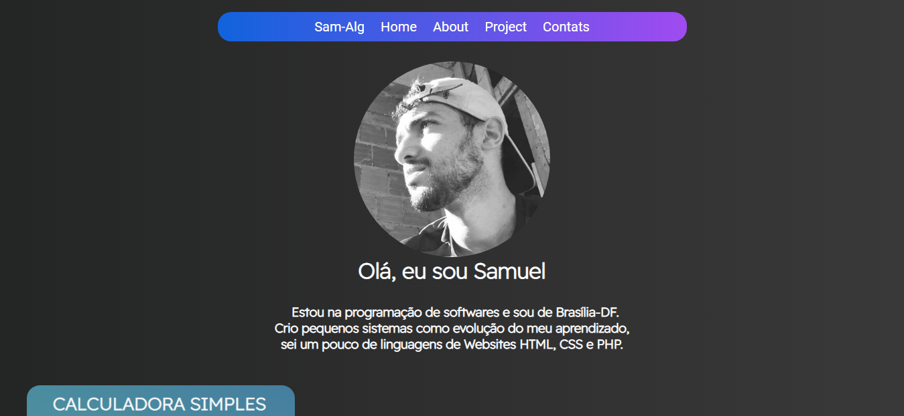

# :rocket: Samm-Alg :globe_with_meridians:

## :open_book: Portfolio

- Esse é meu portfolio que serve para:
- Mostrar minhas habilidades como Dev;
- Serve como uma parte de um currículo;
- Mostrar minha evolução nas linguagens.
  
## :artificial_satellite: Tecnologias usadas 

## :ringed_planet: Front-end Site 

## By:
###  Sammuel_Rod 
 -> Brevemente irei atualizar e adicionar novas tecnologias ! 

 
